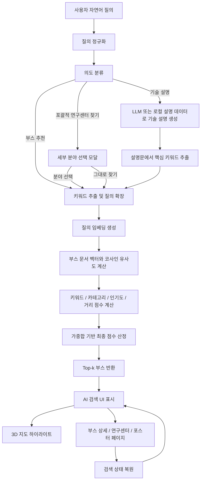

# RAG 기반 의미 검색과 3D 지도 연동을 활용한 전시 부스 추천 키오스크 시스템

성명1, 성명2, 성명3  
소속1, 소속2  
e-mail: example@example.com

## 요약

대규모 학술·기술 전시회에서는 수십 개 이상의 연구센터와 부스가 제한된 전시장 안에 배치된다. 관람객은 짧은 시간 안에 자신의 관심 주제와 관련된 부스를 탐색해야 하지만, 기존 키오스크는 주로 카테고리 선택, 부스 목록 탐색, 상세 페이지 진입과 같은 단계적 메뉴 구조에 의존한다. 이 방식은 사용자가 정확한 부스명이나 분야명을 알고 있을 때는 유효하지만, “AI 반도체 연구하는 곳”, “양자 보안 관련 연구센터”, “드론 관련 부스”와 같이 자연어로 관심사를 표현하는 상황에서는 탐색 깊이가 길어지고 원하는 부스를 찾기 어렵다. 또한 검색 결과와 실제 전시장 내 위치 안내가 분리되어 있어, 정보 검색이 관람 동선으로 자연스럽게 연결되지 않는 문제가 있다.

본 논문은 HI-ITRC 전시 키오스크를 대상으로, RAG(Retrieval-Augmented Generation) 기반 의미 검색과 3D 전시장 지도 연동을 결합한 부스 추천 시스템을 제안한다. 제안 시스템은 부스명, 대학명, 연구센터명, 카테고리, 위치, 연구 키워드 등의 구조화 메타데이터를 부스 문서로 변환하고, 한국어 문장 임베딩 모델을 이용하여 사용자 질의와 부스 문서 간 의미 유사도를 계산한다. 이후 의미 유사도, 키워드 일치도, 카테고리 적합도, 부스 인기도, 현재 위치 기반 거리 점수를 결합한 하이브리드 재정렬 점수로 Top-k 부스를 추천한다. 기술 설명 질의의 경우에는 LLM이 생성한 설명에서 핵심 키워드를 추출하고, 이를 다시 RAG 검색 질의로 변환하여 관련 연구센터를 추천한다. 또한 “AI 연구센터 찾기”처럼 후보 범위가 과도하게 넓은 질의는 즉시 하나의 결과로 이동하지 않고, 배경 블러 기반 심화 탐색 모달을 통해 세부 연구 분야를 선택하도록 설계하였다.

제안 시스템의 주요 기여는 다음과 같다. 첫째, 기존 메뉴 기반 키오스크의 깊은 탐색 흐름을 자연어 기반 의미 검색으로 단축하였다. 둘째, 부스 텍스트뿐 아니라 카테고리, 위치, 인기도 등 전시 환경 특화 메타데이터를 결합한 검색 점수 산정 방식을 제안하였다. 셋째, 검색 결과를 3D 지도 하이라이트와 상세 페이지 이동으로 연결하여 정보 탐색과 공간 탐색을 통합하였다. 넷째, 포괄적인 연구센터 탐색 질의에 대해 세부 분야 선택 단계를 삽입하여 부정확한 단일 결과 이동을 줄였다. 다섯째, LLM은 설명 생성 보조에 제한하고 추천의 핵심은 RAG 검색 결과에 두어, 외부 LLM 의존성과 추천 근거의 불투명성을 줄였다. 본 연구는 향후 전시 키오스크가 단순 안내 장치를 넘어 관람객의 의도와 현장 맥락을 반영하는 지능형 전시 안내 시스템으로 발전할 수 있음을 보인다.

**주제어:** RAG, 의미 검색, 전시 키오스크, 부스 추천, 문장 임베딩, 하이브리드 검색, 3D 지도

## 1. 서론

최근 기술 전시회는 인공지능, 반도체, 양자, 보안, 로보틱스, 바이오헬스케어 등 다양한 분야의 연구 성과를 한 공간에 집약하여 제공한다. 이러한 전시는 관람객에게 풍부한 정보를 제공한다는 장점이 있지만, 동시에 원하는 부스를 찾는 과정을 복잡하게 만든다. 특히 HI-ITRC와 같이 다수의 대학 연구센터가 참여하는 전시회에서는 부스명이 연구 주제와 직접적으로 일치하지 않는 경우가 많고, 하나의 기술 키워드가 여러 분야에 걸쳐 나타난다. 예를 들어 “AI”라는 관심사는 AI 빅데이터, AI 반도체, AI 플랫폼, 로보틱스, 의료 AI 등 여러 카테고리로 확장될 수 있다. 따라서 관람객이 단순히 카테고리 목록을 순차적으로 탐색하는 방식은 시간과 인지적 부담이 크다.

기존 전시 키오스크의 일반적인 탐색 흐름은 다음과 같다. 사용자는 먼저 전체 메뉴에서 부스 안내를 선택하고, 카테고리를 고른 뒤, 긴 부스 목록에서 연구센터명을 확인하고, 상세 페이지에 들어가 내용을 읽은 후, 필요하면 다시 목록으로 돌아가 다른 부스를 확인한다. 이 구조는 명확하고 안정적이지만, 관심 주제 중심의 탐색에는 적합하지 않다. 사용자가 “보안 관련 연구를 보고 싶다”고 생각하더라도, 해당 연구가 클라우드 보안, 블록체인, 데이터 프라이버시, 딥페이크, 제로트러스트 중 어디에 속하는지 미리 알아야 한다. 결과적으로 키오스크 사용자는 원하는 부스를 찾기 위해 여러 화면을 반복적으로 이동해야 하며, 이는 실제 전시장처럼 이동 시간과 체류 시간이 중요한 환경에서 불편을 초래한다.

또 다른 문제는 정보 탐색과 공간 탐색이 분리되어 있다는 점이다. 일반적인 키오스크는 부스 정보를 목록 형태로 보여주지만, 관람객이 실제로 해당 부스를 방문하려면 전시장 지도에서 다시 위치를 확인해야 한다. 즉, “어떤 부스가 관련 있는가”와 “그 부스가 어디에 있는가”가 하나의 흐름으로 연결되지 않는다. 전시 현장에서는 이 두 질문이 동시에 중요하다. 아무리 관련성이 높은 부스라도 현재 위치에서 지나치게 멀거나 동선상 비효율적이라면 관람객의 실제 선택에는 영향을 줄 수 있다.

본 연구는 이러한 문제를 해결하기 위해 RAG 기반 의미 검색과 3D 지도 연동을 결합한 전시 부스 추천 키오스크 시스템을 제안한다. 제안 시스템은 사용자의 자연어 질의를 분석하고, 부스 문서와의 의미 유사도를 계산하여 관련 부스를 추천한다. 또한 검색 결과를 전시장 3D 지도에 하이라이트하여 사용자가 추천 결과를 공간적으로 이해할 수 있도록 한다. 본 논문은 단순한 LLM 챗봇 적용이 아니라, 전시 부스 추천이라는 제한된 도메인에서 RAG 검색을 중심으로 한 재현 가능한 추천 구조를 설계하고 구현했다는 점에 의의가 있다.

본 논문의 기여는 다음과 같이 정리된다.

1. **전시 키오스크 탐색 문제의 재정의:** 기존 키오스크의 깊은 메뉴 탐색 문제를 자연어 질의 기반 검색 문제로 전환하고, 관람객의 관심 주제와 부스 메타데이터를 연결하는 구조를 제안한다.
2. **메타데이터 인지형 RAG 검색 방법:** 부스명 중심 검색이 아니라 부스명, 대학명, 분야, 연구 키워드, 위치, 인기도를 포함한 구조화 문서를 생성하고, 의미 유사도와 메타데이터 점수를 결합한다.
3. **전시장 맥락 기반 재정렬:** 검색 결과에 현재 위치 기반 거리 점수와 카테고리 적합도를 반영하여, 전시 현장에서 실제로 활용 가능한 추천 결과를 제공한다.
4. **LLM 의존도 완화:** LLM은 기술 설명과 응답 보조에 사용하고, 추천 결과는 RAG 검색 점수에 기반하도록 하여 비용, 지연 시간, 환각 가능성, 재현성 문제를 줄인다.
5. **포괄 질의 심화 탐색 UI:** “AI 연구센터 찾기”와 같이 의미 범위가 넓은 질의에 대해 세부 연구 분야 선택 모달을 제공하여, 검색 의도를 구체화한 뒤 연구센터 정보 페이지로 이동한다.
6. **검색-지도-상세 페이지 통합 UI:** 추천 부스를 3D 지도 하이라이트, 관련 부스 카드, 상세 페이지, 포스터 페이지와 연결하여 탐색 흐름을 단축한다.

## 2. 관련 연구 및 기술 배경

### 2.1 전시 안내 키오스크의 탐색 구조

전시 안내 키오스크는 행사 정보, 부스 안내, 프로그램, 지도 등을 제공하는 공공 상호작용 시스템이다. 기존 키오스크는 명확한 메뉴 구조와 터치 기반 조작을 제공한다는 장점이 있으나, 정보 구조가 깊어질수록 탐색 비용이 증가한다. 특히 부스 수가 많고 카테고리가 세분화된 전시회에서는 사용자가 자신에게 적합한 카테고리를 먼저 선택해야 하므로, 사전 지식이 부족한 관람객에게는 진입 장벽이 생긴다.

본 연구에서 대상으로 한 전시 환경의 문제는 다음과 같다.

- 부스 수가 많아 목록 탐색만으로는 원하는 연구센터를 찾기 어렵다.
- 연구센터명만으로는 실제 연구 주제를 직관적으로 파악하기 어렵다.
- 하나의 관심 키워드가 여러 카테고리에 분산되어 있다.
- 부스 검색 결과가 지도상의 위치 안내와 즉시 연결되지 않는다.
- 상세 페이지에 들어갔다가 돌아오면 이전 탐색 맥락이 끊어질 수 있다.

따라서 전시 키오스크는 단순 정보 제공을 넘어, 사용자의 관심사를 이해하고 관련 부스를 추천하며, 추천 결과를 실제 전시장 동선으로 연결하는 기능이 요구된다.

### 2.2 문장 임베딩 기반 의미 검색

문장 임베딩은 자연어 문장이나 문서를 고차원 벡터 공간에 매핑하는 기술이다. 동일한 임베딩 공간에서 두 문장의 벡터가 가까울수록 의미적으로 유사하다고 판단할 수 있다. 기존 키워드 검색은 질의와 문서 사이의 표면적 단어 일치에 의존하지만, 문장 임베딩 기반 검색은 표현이 다르더라도 의미가 유사한 문서를 찾을 수 있다.

전시 부스 추천에서 의미 검색은 특히 중요하다. 예를 들어 “드론”이라는 단어가 부스명에 직접 포함되지 않더라도, “무인자율이동체”, “UAM”, “모빌리티”, “군집체계”와 같은 표현은 의미적으로 관련될 수 있다. 임베딩 기반 검색은 이러한 표현 간 의미적 거리를 반영할 수 있으므로, 관람객이 정확한 전문 용어를 몰라도 관련 부스를 찾을 가능성을 높인다.

### 2.3 RAG와 도메인 근거 기반 추천

RAG는 외부 지식 문서를 검색하고, 검색된 문서를 기반으로 LLM이 응답을 생성하는 구조이다. 일반적인 LLM 응답은 학습 데이터에 의존하기 때문에 특정 전시회의 최신 부스 정보나 위치 정보에는 취약할 수 있다. 반면 RAG는 현재 시스템에 등록된 부스 문서를 직접 검색하므로, 응답과 추천 결과가 실제 전시 데이터에 기반한다.

본 연구에서는 RAG를 전통적인 질의응답 생성보다 “검색 중심 추천 구조”로 사용한다. 즉, LLM이 어떤 부스를 추천할지 직접 결정하지 않고, Python RAG 서비스가 임베딩 검색과 점수 계산을 통해 추천 후보를 산출한다. LLM은 기술 설명, 자연어 응답 보조, 설명문 기반 키워드 추출 후속 검색에 제한적으로 사용된다. 이러한 설계는 다음 장점을 가진다.

- 추천 결과가 부스 데이터와 점수 산정 과정에 근거한다.
- 외부 LLM API 변경에 따른 추천 결과 변동을 줄일 수 있다.
- 디버그 로그를 통해 어떤 키워드와 점수로 추천되었는지 확인할 수 있다.
- 비용과 지연 시간을 검색 단계 중심으로 통제할 수 있다.

## 3. 제안 시스템

### 3.1 전체 시스템 구조

제안 시스템은 React 프론트엔드, Node.js 백엔드 프록시, Python RAG 서비스, 프로젝트 데이터 저장소, 외부 LLM API로 구성된다. React 프론트엔드는 사용자의 입력과 검색 결과 표시를 담당하고, Node.js 백엔드는 브라우저가 Python RAG 서비스와 외부 LLM API를 직접 호출하지 않도록 중계한다. Python RAG 서비스는 부스 문서를 생성하고, 임베딩 벡터 저장소를 구성하며, 사용자 질의에 대한 검색과 재정렬을 수행한다.

Node.js와 Python을 분리한 이유는 시스템 역할을 명확히 하기 위함이다. Node.js는 Vite/React 기반 웹 애플리케이션과 API 프록시 구성에 적합하며, Python은 문장 임베딩 모델, 벡터 연산, RAG 실험 및 검색 모델 개선에 적합하다. 이 구조는 향후 임베딩 모델 교체, 가중치 조정, 벡터 DB 도입, 검색 평가 실험을 프론트엔드와 독립적으로 수행할 수 있게 한다.

### 3.1.1 시스템 아키텍처

```mermaid
flowchart LR
    subgraph Client[React Frontend]
        A1[AI Search Screen<br/>자연어 입력 / 검색 결과 / 기술 설명]
        A2[3D Map Screen<br/>부스 하이라이트 / 지도 탐색]
        A3[Booth Detail Screen<br/>부스 상세 / 포스터 / 연구센터 소개]
        A4[UI State<br/>aiSearchState / 관심 태그]
    end

    subgraph Node[Node.js Backend Proxy]
        B1[/api/rag/search]
        B2[/api/rag/debug]
        B3[/api/rag/tour]
        B4[/api/rag/similar]
        B5[/api/rag/related]
        B6[/api/rag/interaction]
        B7[LLM API Proxy]
    end

    subgraph Python[Python RAG Service]
        C1[Document Builder<br/>부스 문서화]
        C2[Embedding Encoder<br/>SentenceTransformer]
        C3[Vector Store<br/>NumPy Matrix]
        C4[Query Understanding<br/>의도 분류 / 키워드 추출 / 질의 확장]
        C5[Hybrid Retriever<br/>의미 검색 + 메타데이터 재정렬]
        C6[Debug Logger<br/>추천 근거 출력]
        C7[Interaction Logger<br/>선택 로그 / 인기도 갱신]
    end

    subgraph Data[Project Data]
        D1[booths.js<br/>부스명 / 대학 / 카테고리]
        D2[boothPositions.js<br/>부스 위치]
        D3[posters<br/>포스터 데이터]
        D4[centerInfo<br/>연구센터 소개]
    end

    subgraph External[External LLM]
        E1[기술 설명 / 응답 보조]
    end

    A1 --> B1
    A1 --> B5
    A1 --> B7
    A1 --> A2
    A2 --> A3
    A3 --> A4
    A3 --> B6
    A4 --> A1

    B1 --> C5
    B2 --> C6
    B3 --> C5
    B4 --> C5
    B5 --> C5
    B6 --> C7
    B7 --> E1

    D1 --> C1
    D2 --> C1
    C1 --> C2
    C2 --> C3
    C4 --> C5
    C3 --> C5
    C5 --> B1
    C5 --> B5
    C6 --> B2
    C7 --> B6

    D3 --> A3
    D4 --> A3
    E1 --> B7
    B7 --> A1
```

### 3.1.2 처리 파이프라인



## 4. 방법론

### 4.1 부스 문서 생성

RAG 검색의 품질은 검색 대상 문서를 어떻게 구성하는지에 크게 영향을 받는다. 본 시스템은 단순히 부스명만 검색 대상으로 사용하지 않고, 각 부스를 하나의 구조화 문서로 변환한다. 문서에는 부스 ID, 부스명, 대학명, 카테고리, 카테고리 라벨, 위치, 연구 키워드, 연구 주제, 요약문, 인기도 추정값이 포함된다.

부스 문서 \(d_i\)는 다음과 같이 정의할 수 있다.

```text
d_i = {
  id_i,
  name_i,
  university_i,
  category_i,
  categoryLabel_i,
  keywords_i,
  location_i,
  position_i,
  popularity_i,
  text_i
}
```

여기서 `text_i`는 실제 임베딩에 사용되는 통합 문서 문자열이다. 이 문자열은 부스명, 대학명, 카테고리 라벨, 키워드, 연구 주제, 위치 정보를 결합하여 생성된다. 이 방식은 부스명에 직접 포함되지 않은 분야 정보도 임베딩 검색에 반영되도록 한다.

예를 들어 “AI 반도체 프로세싱 SW 연구센터” 부스는 다음과 같은 정보를 포함한다.

```json
{
  "booth_id": "S7B2",
  "booth_name": "AI 반도체 프로세싱 SW 연구센터",
  "university": "서울과학기술대학교",
  "category": "ai_semiconductor",
  "category_label": "AI 반도체 디스플레이",
  "keywords": ["AI", "반도체", "프로세싱", "온디바이스", "시스템반도체"],
  "location": "S7-B2",
  "position": [x, y]
}
```

이러한 문서화 방식은 본 연구의 첫 번째 기술적 기여이다. 기존 키오스크의 검색 대상이 주로 부스명 또는 카테고리명에 제한되는 것과 달리, 본 시스템은 전시 부스의 구조적 속성을 검색 문서에 융합한다.

### 4.2 질의 이해와 확장

사용자 질의 \(q\)는 먼저 정규화 과정을 거친다. 공백, 대소문자, 특수문자를 정리한 뒤, 질의에 포함된 표현을 기반으로 의도를 분류한다. 의도는 일반 부스 검색, 기술 설명, 연구센터 소개, 투어 추천, 유사 연구 검색 등으로 나뉜다.

다음으로 키워드 추출을 수행한다. 한글은 2글자 이상 토큰을 중심으로 추출하고, 영문과 숫자 토큰도 유지한다. 또한 카테고리별 사전에 포함된 기술 용어가 질의에 등장하면 이를 우선 키워드로 포함한다. 예를 들어 “보안 연구실 어디야”라는 질의에서는 `보안`, `연구실`뿐 아니라 보안 카테고리와 연결된 `클라우드`, `블록체인`, `프라이버시`, `제로트러스트` 등이 확장 후보로 고려될 수 있다.

질의 확장 \(E(q)\)는 다음과 같이 표현할 수 있다.

```text
E(q) = Unique(q ∪ K(q) ∪ S(K(q)))
```

여기서 \(K(q)\)는 질의에서 추출한 키워드 집합이고, \(S(K(q))\)는 키워드 사전에 기반한 확장어 집합이다. 예를 들어 `드론`은 `무인 이동체`, `UAM`, `모빌리티`, `로봇` 등으로 확장된다. 이 과정은 관람객이 전시회에서 사용하는 일상 표현과 실제 연구센터가 사용하는 전문 용어 사이의 간극을 줄인다.

다만 모든 질의를 곧바로 검색으로 보내는 것은 적절하지 않다. “AI 연구센터 찾기”, “보안 연구센터 보여줘”와 같은 질의는 연구센터 탐색 의도는 명확하지만, 후보 범위가 지나치게 넓어 하나의 연구센터 정보 페이지로 바로 이동하면 사용자의 실제 관심 분야와 어긋날 수 있다. 본 시스템은 이러한 질의를 포괄 질의로 판별하고, 검색 실행 전에 세부 분야 선택 모달을 표시한다. 모달은 기존 검색 화면을 흐리게 처리한 뒤 `AI·빅데이터`, `반도체·디스플레이`, `인공지능 플랫폼·서비스`, `로봇·모빌리티`, `바이오·헬스케어`, `보안·블록체인`과 같은 분야 선택지를 제공한다. 사용자가 하나의 분야를 선택하면 기존 질의에 해당 분야를 결합하여 `AI 반도체·디스플레이 연구센터 찾기`와 같은 구체화 질의를 생성하고, 이후 RAG 검색과 연구센터 정보 페이지 이동을 수행한다. 사용자가 “그대로 찾기”를 선택한 경우에는 원 질의를 유지하여 검색한다. 이 단계는 단순 UI 보조가 아니라 검색 전 질의 명확화(query clarification) 과정으로, 포괄 질의에서 발생하는 오추천과 불필요한 화면 이동을 줄이기 위한 장치이다.

### 4.3 임베딩 기반 후보 검색

확장된 질의 \(E(q)\)는 하나의 문자열로 결합되어 임베딩 모델에 입력된다. 본 시스템은 기본적으로 `jhgan/ko-sroberta-multitask` 문장 임베딩 모델을 사용한다. 부스 문서 또한 시스템 시작 시 같은 모델로 임베딩되어 NumPy 행렬에 저장된다.

질의 벡터와 문서 벡터는 다음과 같이 정의된다.

```text
v_q = Encoder(E(q))
v_i = Encoder(text_i)
```

문서 \(d_i\)에 대한 의미 유사도는 정규화된 벡터의 내적으로 계산된다.

```text
S_sem(q, d_i) = cosine(v_q, v_i)
              = (v_q · v_i) / (||v_q|| ||v_i||)
```

임베딩 모델이 정규화된 벡터를 반환하므로 실제 구현에서는 NumPy 행렬 곱으로 전체 문서에 대한 유사도를 한 번에 계산한다.

```text
semantic_scores = V_D × v_q
```

여기서 \(V_D\)는 모든 부스 문서 벡터를 쌓은 행렬이다. 이 방식은 부스 수가 수십~수백 규모인 전시 키오스크 환경에서 충분히 빠르게 동작한다.

### 4.4 메타데이터 기반 하이브리드 재정렬

의미 유사도만으로는 전시 환경의 맥락을 충분히 반영하기 어렵다. 예를 들어 “AI”와 같은 광범위한 질의에서는 여러 카테고리의 부스가 의미적으로 모두 높은 점수를 받을 수 있다. 또한 실제 관람객에게는 부스의 위치와 접근성도 중요하다. 따라서 본 시스템은 의미 유사도 기반 후보 검색 후, 다음 다섯 가지 요소를 결합하여 최종 점수를 계산한다.

```text
Score(q, d_i) =
  w_sem  · S_sem(q, d_i)
+ w_key  · S_key(q, d_i)
+ w_cat  · S_cat(q, d_i)
+ w_pop  · S_pop(d_i)
+ w_dist · S_dist(d_i)
```

현재 구현에서 가중치는 다음과 같이 설정하였다.

```text
w_sem  = 0.62
w_key  = 0.20
w_cat  = 0.12
w_pop  = 0.04
w_dist = 0.02
```

가중치의 합은 1.0이 되도록 설정하였다. 의미 유사도에 가장 큰 비중을 둔 이유는 사용자의 자연어 의도와 부스 문서의 의미적 관련성이 추천의 핵심이기 때문이다. 그러나 의미 유사도만 사용할 경우 부스명이나 분야명에 직접 포함된 명확한 단서가 약화될 수 있으므로, 키워드 일치도에 0.20의 보조 가중치를 부여하였다. 카테고리 적합도는 사용자가 특정 기술 분야를 언급했을 때 같은 분야의 부스를 상향시키기 위해 0.12를 부여하였다. 인기도와 거리 점수는 추천 품질을 보조하는 전시 현장 맥락 정보이므로 각각 0.04와 0.02로 낮게 설정하였다.

#### 4.4.1 키워드 점수

키워드 점수는 확장 질의 키워드가 부스 문서 텍스트에 얼마나 포함되는지를 측정한다. 질의 확장어 집합을 \(T_q\)라고 할 때, 키워드 점수는 다음과 같이 계산된다.

```text
S_key(q, d_i) = min(1, matched(T_q, text_i) / min(|T_q|, 8))
```

여기서 `matched`는 질의 키워드 중 부스 문서 텍스트에 포함된 키워드 수이다. 분모를 최대 8개로 제한한 이유는 질의 확장으로 키워드가 과도하게 많아질 경우 점수가 불필요하게 낮아지는 것을 방지하기 위함이다. 따라서 질의 확장이 풍부하더라도 핵심 키워드 몇 개가 문서와 일치하면 충분한 점수를 받을 수 있다.

#### 4.4.2 카테고리 점수

카테고리 점수는 질의에서 추론된 관심 분야와 부스의 실제 카테고리가 얼마나 일치하는지를 나타낸다. 먼저 카테고리별 키워드 사전을 이용하여 질의 확장어가 어떤 분야와 관련되는지 계산한다. 카테고리 \(c\)에 대한 질의 적합도는 다음과 같이 표현할 수 있다.

```text
Q_cat(c) = min(1, matchCount(c, E(q)) / max(2, |K_c| × 0.35))
```

여기서 \(K_c\)는 카테고리 \(c\)에 속한 키워드 사전이다. 문서 \(d_i\)의 카테고리가 \(c_i\)일 때 카테고리 점수는 다음과 같다.

```text
S_cat(q, d_i) = Q_cat(c_i)
```

이 방식은 “양자”, “보안”, “6G”, “반도체”처럼 분야 식별력이 강한 질의에서 해당 카테고리의 부스가 상위에 배치되도록 한다.

#### 4.4.3 인기도 점수

인기도 점수는 부스가 사용자에게 선택될 가능성을 보조적으로 반영한다. 현재 구현에서는 부스 속성에 기반한 초기 추정값과 실제 사용자 상호작용 로그를 혼합한다. 초기 인기도 \(S_{base}(d_i)\)는 부스 데이터에 포함된 카테고리, 키워드 수, 연구센터 정보 존재 여부와 같은 정적 속성으로부터 산정된다. 상호작용 인기도 \(S_{log}(d_i)\)는 검색 결과 클릭, 연구센터 정보 페이지 진입, 3D 지도 확인, 포스터 상세 보기와 같은 이벤트를 `/rag/interaction` 엔드포인트로 기록한 뒤, 부스별 누적 횟수에 로그 스케일을 적용하여 계산한다.

```text
S_log(d_i) = min(1, log(1 + count(d_i)) / log(1 + C_max))

S_pop(d_i) = min(1, 0.65 · S_base(d_i) + 0.35 · S_log(d_i))
```

여기서 \(count(d_i)\)는 부스 \(d_i\)에 대해 기록된 상호작용 횟수이고, \(C_{max}\)는 전체 부스 중 최대 상호작용 횟수이다. 로그 스케일을 사용하는 이유는 특정 부스에 클릭이 집중되더라도 인기도 점수가 과도하게 커지는 것을 방지하기 위함이다. 또한 최종 검색 점수에서 인기도 가중치 \(w_{pop}\)를 0.04로 낮게 설정하여, 인기도는 의미적으로 무관한 부스를 상위로 올리는 주 요인이 아니라 동일한 관련도 후보 사이의 보조 정렬 신호로만 작동하도록 하였다. 이 설계는 실제 전시 운영 중 축적되는 선택 로그를 추천 품질 개선에 반영하면서도, 검색 결과의 중심을 사용자의 질의 의미와 부스 문서 관련성에 유지한다.

#### 4.4.4 거리 점수

전시회에서는 추천 부스의 공간적 접근성이 중요하다. 따라서 현재 키오스크 위치 또는 현재 선택된 부스 위치가 주어질 경우, 부스 위치와의 거리를 기반으로 거리 점수를 계산한다.

```text
S_dist(d_i) = 1 / (1 + dist(p_i, p_cur) / 12)
```

여기서 \(p_i\)는 부스의 좌표이고, \(p_cur\)는 현재 위치 좌표이다. 거리가 가까울수록 점수는 1에 가까워지고, 멀수록 완만하게 감소한다. 12는 전시장 좌표계에서 거리 영향이 지나치게 급격해지지 않도록 조절하는 스케일 상수이다. 위치 정보가 없는 경우에는 중립값 0.5를 부여하여 거리 정보 부재로 인한 과도한 패널티를 방지한다.

#### 4.4.5 최종 재정렬

시스템은 먼저 의미 유사도 기준 상위 후보를 넉넉히 선택한다. 구현에서는 `candidate_limit = max(top_k × 4, 12)`로 설정하여, 최종 Top-k보다 많은 후보를 확보한다. 이후 각 후보에 대해 위의 다섯 점수를 계산하고 가중합으로 최종 점수를 산정한다. 마지막으로 최종 점수 기준 내림차순 정렬을 수행하여 Top-k 결과를 반환한다. 이 구조는 임베딩 기반 검색의 의미적 포괄성과 메타데이터 기반 검색의 정확성을 동시에 활용한다.

### 4.5 기술 설명 질의와 관련 부스 추천

본 시스템은 모든 질의를 부스 검색으로 처리하지 않는다. 사용자가 “양자 기술이란?”, “LLM 설명해줘”와 같이 개념 설명을 요청한 경우, 일반 검색 결과 목록 대신 기술 설명과 관련 부스 추천만 표시한다. 이 설계는 기술 개념을 알고 싶어 하는 사용자에게 불필요한 검색 결과 카드를 노출하지 않기 위한 것이다.

처리 과정은 다음과 같다.

1. 질의가 기술 설명 의도인지 판단한다.
2. 로컬 기술 설명 데이터에 해당 항목이 있으면 이를 사용하고, 없으면 LLM에 설명 생성을 요청한다.
3. 생성된 설명문과 사용자 질문을 결합하여 핵심 키워드를 추출한다.
4. 추출된 키워드와 설명문을 다시 RAG 검색 질의로 변환한다.
5. Python RAG 서비스가 관련 연구센터를 검색한다.
6. 화면에는 관련 부스명과 대학명만 간결히 표시하고, 추천 근거는 터미널 로그로 출력한다.

이 방식의 장점은 기술 설명과 부스 추천이 분리되지 않는다는 점이다. 사용자는 먼저 기술 개념을 이해하고, 곧바로 해당 기술을 전시하는 실제 연구센터를 확인할 수 있다. 또한 추천 이유와 매칭 키워드는 `[AI Related Booths]` 로그와 RAG 디버그 출력에서 확인할 수 있으므로, 개발자는 추천 결과의 근거를 추적할 수 있다.

### 4.6 카테고리 클러스터링과 질의 구체화

광범위한 질의는 여러 카테고리의 결과를 동시에 반환한다. 예를 들어 “AI”는 AI 빅데이터, AI 반도체, AI 플랫폼, 의료 AI, 로보틱스 등으로 분산된다. 이러한 경우 시스템은 Top-k 결과를 카테고리별로 묶고, 각 카테고리의 개수를 프론트엔드에 전달한다. 사용자는 카테고리 탭을 통해 관심 분야로 질의를 구체화할 수 있다.

이 기능은 단순 필터가 아니라 검색 질의를 재구성하는 방식으로 동작한다. 예를 들어 사용자가 “AI”를 검색한 뒤 “AI 반도체” 카테고리 탭을 선택하면, 시스템은 기존 검색어에 누적하여 계속 붙이는 것이 아니라 기존 조건을 제거하고 “AI AI 반도체 관련 부스 추천”과 같이 새 질의를 구성한다. 이를 통해 카테고리 탭을 반복 선택해도 검색어가 스택처럼 길어지는 문제를 방지한다.

### 4.7 포괄 질의 기반 심화 탐색 모달

연구센터 찾기 의도는 일반 부스 검색보다 더 높은 정확도를 요구한다. 일반 검색 결과는 여러 후보를 목록으로 보여줄 수 있지만, 연구센터 찾기 흐름은 사용자를 특정 연구센터 정보 페이지로 직접 이동시키기 때문이다. 따라서 “AI 연구센터 찾기”처럼 범위가 넓은 질의를 그대로 처리하면, 가장 높은 점수를 받은 한 부스가 사용자의 의도를 대표한다고 가정하게 되는 문제가 생긴다.

본 시스템은 이를 해결하기 위해 포괄 질의 감지 규칙을 적용한다. 질의에 `연구센터`, `센터`, `사업단`, `연구원`과 같은 대상 표현과 `찾기`, `보여줘`, `상세`, `페이지`, `이동`과 같은 탐색 표현이 함께 등장하는 경우 연구센터 찾기 의도로 판단한다. 이후 질의가 이미 `반도체`, `보안`, `로봇`, `바이오`, `통신`, `양자`처럼 구체 분야를 포함하는지 검사한다. 구체 분야가 없고 `AI`, `인공지능`, `데이터`처럼 여러 전시 카테고리로 확장될 수 있는 표현만 포함되어 있으면 포괄 질의로 분류한다.

포괄 질의로 분류되면 AI 검색 화면은 검색 결과를 즉시 갱신하지 않고, 배경을 흐리게 처리한 모달을 표시한다. 모달은 사용자가 선택할 수 있는 세부 연구 분야를 제시하며, 선택된 분야는 기존 질의를 대체하는 새 검색 조건으로 사용된다. 예를 들어 `AI 연구센터 찾기`에서 `반도체·디스플레이`를 선택하면 내부 질의는 `AI 반도체·디스플레이 연구센터 찾기`로 재구성된다. 이때 기존 검색창에 분야명이 계속 누적되지 않도록 정규화된 기본 질의와 선택 분야를 조합한다. 이후 Python RAG 서비스는 재구성된 질의를 임베딩 검색과 하이브리드 재정렬에 사용하고, 가장 적합한 연구센터 정보 페이지로 이동한다.

이 방식은 시스템이 사용자에게 추가 입력을 강제로 요구하는 것이 아니라, 오탐 가능성이 높은 질의에서만 최소한의 clarification 단계를 제공한다는 점에서 의미가 있다. 사용자가 이미 충분히 구체적인 질의를 입력한 경우에는 모달 없이 바로 검색한다. 반대로 포괄 질의에서는 모달이 검색 전 필터 역할을 수행하여, 잘못된 연구센터로 직접 이동하는 위험을 줄이고 관람객이 자신의 관심 분야를 짧은 상호작용 안에서 명확히 할 수 있도록 한다.

### 4.8 3D 지도 연동과 상태 유지

검색 결과는 3D 지도 화면으로 전달되어 부스 위치 하이라이트로 표현된다. 사용자가 “3D 맵에서 확인”을 선택하면 검색 결과의 부스 ID 목록이 지도 컴포넌트로 전달되고, 지도는 해당 부스 위에 시각적 강조 표시를 렌더링한다. 하이라이트 영역에는 검색된 부스 목록이 작게 표시되며, 사용자는 드래그를 통해 목록을 확인할 수 있다.

또한 검색 결과에서 부스 상세 페이지, 연구센터 소개, 포스터 페이지로 이동한 뒤 뒤로 가기를 누르면 이전 검색 결과가 유지되어야 한다. 이를 위해 본 시스템은 `aiSearchState`를 네비게이션 데이터에 포함한다. `aiSearchState`에는 검색어, 입력창 값, RAG 검색 결과, 기술 설명 결과가 포함된다. 상세 페이지에서 뒤로 이동하면 이 상태를 AI 검색 화면에 다시 전달하여 검색 흐름이 끊기지 않도록 한다.

## 5. 구현

### 5.1 Python RAG 서비스 구현

Python RAG 서비스는 FastAPI로 구현되었으며, 주요 엔드포인트는 다음과 같다.

| 엔드포인트 | 기능 |
|---|---|
| `/health` | RAG 서비스 상태, 문서 수, 임베딩 백엔드 확인 |
| `/rag/search` | 사용자 질의 기반 부스 검색 |
| `/rag/debug` | 인덱싱, 임베딩, 검색, 프롬프트 변환 과정 출력 |
| `/rag/tour` | 추천 부스 투어 경로 생성 |
| `/rag/similar` | 특정 부스와 유사한 연구 부스 검색 |
| `/rag/related` | 기술 설명문에서 추출한 키워드 기반 관련 부스 검색 |
| `/rag/interaction` | 검색 결과 클릭, 지도 확인, 상세 페이지 진입 로그 저장 |

`/rag/debug`는 논문 실험 및 개발 검증에 중요한 역할을 한다. 이 엔드포인트는 다음 정보를 반환한다.

- 원본 부스 데이터가 어떤 문서로 변환되었는지
- 문서 임베딩 벡터의 shape와 일부 preview
- 사용자 질의에서 추출된 키워드와 확장 질의
- Top-k 결과의 semantic, keyword, category, popularity, distance 점수
- LLM에 전달하기 직전의 RAG 프롬프트 형태

이를 통해 추천 결과가 단순히 블랙박스 LLM에서 나온 것이 아니라, 검색 가능한 문서와 점수 계산에 기반했음을 확인할 수 있다.

`/rag/related`는 기술 설명 질의 처리에서 사용된다. 프론트엔드가 사용자 질문과 LLM 설명문을 전달하면 Python RAG 서비스는 설명문에서 기술 키워드를 추출하고, 키워드 사전 및 임베딩 검색을 이용해 관련 연구센터를 반환한다. 이때 어떤 키워드가 추출되었고 어떤 부스 키워드와 매칭되었는지는 터미널 로그로 출력된다. `/rag/interaction`은 사용자의 클릭과 페이지 이동 이벤트를 저장하여, 이후 인기도 점수 \(S_{pop}\) 계산에 반영한다.

### 5.2 Node.js 백엔드 프록시 구현

Node.js 백엔드는 프론트엔드와 Python RAG 서비스 사이의 중계 계층이다. 프론트엔드는 `/api/rag/search`와 같은 동일 출처 API를 호출하고, Node.js 서버는 이를 Python RAG 서비스의 `/rag/search`로 전달한다. 또한 외부 LLM API 호출도 Node.js 백엔드에서 수행하여 API 키가 브라우저에 노출되지 않도록 한다.

현재 구현에서는 일반 검색을 위한 `/api/rag/search`뿐 아니라, 기술 설명 기반 관련 부스 추천을 위한 `/api/rag/related`, 사용자 상호작용 로그 저장을 위한 `/api/rag/interaction`도 Node.js 계층에서 중계한다. 따라서 프론트엔드는 RAG 검색, 관련 부스 추천, 인기도 로그 저장을 모두 동일 출처 API로 호출하고, 실제 Python 서비스 주소와 포트는 백엔드 설정에 의해 관리된다.

이 구조는 다음 장점을 가진다.

- API 키와 외부 서비스 주소를 클라이언트에서 숨길 수 있다.
- Python RAG 서비스의 포트나 배포 위치가 바뀌어도 프론트엔드 수정이 최소화된다.
- LLM 호출과 RAG 호출을 백엔드에서 통합 관리할 수 있다.
- 장애 발생 시 Node.js 계층에서 오류 메시지를 표준화할 수 있다.

### 5.3 React 프론트엔드 구현

React 프론트엔드는 AI 검색 화면과 3D 지도 화면을 중심으로 구현되었다. AI 검색 화면은 다음 기능을 제공한다.

- 자연어 검색 입력
- 가상 키보드 입력
- 검색 템플릿 선택
- RAG 검색 결과 목록
- 카테고리별 결과 개수 탭
- 기술 설명 카드
- 설명 기반 관련 부스 추천
- 포괄 연구센터 질의 심화 탐색 모달
- 연구센터 정보 페이지 직접 이동
- 3D 지도 확인 액션

일반 부스 검색에서는 RAG 결과 카드가 표시되고, 기술 설명 검색에서는 일반 검색 결과를 표시하지 않고 기술 설명과 관련 부스 추천만 보여준다. 이는 사용자 의도에 따라 UI 밀도를 조정한 것이다. 또한 관련 부스 추천 영역은 화면을 과도하게 차지하지 않도록 스크롤 가능하게 구성하고, 스크롤바 UI는 숨겨 키오스크 화면의 시각적 복잡도를 낮추었다.

연구센터 찾기 템플릿이나 사용자의 직접 입력이 포괄적인 경우에는 검색 결과를 바로 갱신하지 않고 심화 탐색 모달을 표시한다. 이 모달은 기존 검색 화면을 흐리게 처리한 상태에서 세부 연구 분야 선택지를 제공하며, 선택된 분야는 새 RAG 질의로 변환된다. 반대로 이미 구체적인 연구 분야가 포함된 질의는 모달 없이 바로 검색한다. 이 흐름을 통해 사용자는 “연구센터 찾기” 의도를 유지하면서도 한 번의 추가 선택만으로 더 정확한 연구센터 정보 페이지에 도달할 수 있다.

3D 지도 화면은 검색 결과 부스를 지도에서 하이라이트한다. 검색 결과가 여러 개인 경우 하이라이트 설명 영역과 가로 스크롤 목록을 제공하여 사용자가 추천 부스를 공간적으로 확인할 수 있다.

## 6. 평가 계획

### 6.1 검색 정확도 평가

검색 정확도는 대표 질의 집합을 구성하여 평가할 수 있다. 각 질의에 대해 정답 또는 관련 부스 집합을 정의하고, 추천 결과가 Top-k 안에 포함되는지 측정한다.

| 질의 | 기대 관련 분야 | 평가 지표 |
|---|---|---|
| AI 반도체 연구하는 곳 있어? | AI 반도체 | Top-3 Accuracy |
| 드론 관련 부스 찾아줘 | 로보틱스/모빌리티 | Top-5 Recall |
| 보안 연구실 어디야? | 클라우드/보안 | MRR |
| 양자 기술 관련 연구센터 | 양자 | Top-5 Recall |
| 6G 통신 연구센터 | 차세대 통신 | Top-3 Accuracy |

정량 지표로는 Top-k Accuracy, Recall@k, MRR(Mean Reciprocal Rank)을 사용할 수 있다. 특히 전시 키오스크에서는 사용자가 첫 화면에서 몇 개의 결과만 확인하는 경우가 많으므로 Top-3 또는 Top-5 성능이 중요하다.

### 6.2 사용자 경험 평가

제안 시스템의 핵심 목표는 단순 검색 정확도뿐 아니라 탐색 흐름의 단축이다. 따라서 기존 메뉴 기반 탐색과 AI 검색 기반 탐색을 비교하여 다음 지표를 측정할 수 있다.

1. 목표 부스 도달 시간
2. 화면 전환 횟수
3. 검색어 재입력 횟수
4. 상세 페이지 도달률
5. 3D 지도 확인 사용률
6. 포괄 질의 모달 선택률
7. 모달 이후 목표 연구센터 정보 페이지 도달률
8. 사용자 만족도

예상되는 효과는 사용자가 카테고리를 순차적으로 탐색하지 않고 자연어 질의로 곧바로 후보 부스를 얻을 수 있다는 점이다. 특히 관심 분야는 알지만 정확한 부스명은 모르는 관람객에게 효과가 클 것으로 기대된다. 포괄 질의 모달의 경우에는 선택률과 “그대로 찾기” 비율을 함께 측정하여, 어떤 분야에서 사용자가 추가 구체화를 필요로 하는지 분석할 수 있다.

### 6.3 로그 기반 추천 근거 분석

본 시스템은 RAG 검색 과정에서 추출 키워드, 확장 질의, 매칭 키워드, 점수 breakdown을 로그로 출력한다. 이를 활용하면 질의별 추천 근거를 분석할 수 있다. 예를 들어 특정 부스가 상위에 추천된 이유가 의미 유사도 때문인지, 카테고리 점수 때문인지, 키워드 일치 때문인지 확인할 수 있다. 이러한 로그는 향후 키워드 사전 보완, 가중치 조정, 평가 데이터셋 구축에 활용될 수 있다.

## 7. 기대 효과 및 향후 연구

제안 시스템이 실제 전시회에 적용될 경우 다음 효과를 기대할 수 있다.

첫째, 관람객의 탐색 시간이 줄어든다. 기존 방식에서는 사용자가 여러 카테고리와 목록을 오가며 부스를 찾아야 했지만, 제안 시스템은 자연어 질의 한 번으로 관련 부스를 추천한다. 이는 키오스크 앞 대기 시간을 줄이고, 관람객이 실제 부스를 방문하는 데 더 많은 시간을 사용할 수 있게 한다.

둘째, 비전문가 관람객의 접근성이 향상된다. 관람객이 정확한 기술 용어나 연구센터명을 모르더라도 “AI”, “보안”, “드론”, “양자”와 같은 관심 키워드로 검색할 수 있다. 시스템은 질의 확장과 의미 검색을 통해 전문 용어와 연결된 부스를 추천한다.

셋째, 포괄적인 질의에서 발생하는 잘못된 직접 이동을 줄일 수 있다. 예를 들어 “AI 연구센터 찾기”는 여러 연구 분야를 포함할 수 있으므로, 시스템이 임의의 상위 결과로 바로 이동하면 사용자가 기대한 분야와 다른 연구센터가 열릴 수 있다. 제안 시스템은 심화 탐색 모달을 통해 관심 분야를 먼저 좁히고, 그 결과를 RAG 검색 질의에 반영함으로써 직접 이동 플로우의 정확성을 높인다.

넷째, 정보 탐색과 공간 탐색이 통합된다. 검색 결과가 3D 지도 하이라이트와 연결되므로 사용자는 추천 부스가 실제 전시장 어디에 있는지 즉시 확인할 수 있다. 이는 전시 환경에서 중요한 동선 계획과 부스 방문 의사결정에 직접적인 도움을 준다.

다섯째, 운영자 입장에서는 로그 기반 개선이 가능하다. 어떤 질의가 많이 입력되는지, 어떤 키워드에서 검색 실패가 발생하는지, 어떤 부스가 자주 선택되는지를 분석하면 전시 운영 중에도 추천 품질을 개선할 수 있다.

향후 연구에서는 실제 관람객 로그를 기반으로 인기도 점수를 동적으로 갱신하고, 현재 위치와 혼잡도를 반영한 동선 최적화 기능을 추가할 수 있다. 또한 다국어 질의 지원, 음성 입력, 개인화 추천, 벡터 DB 도입, 사용자 평가 기반 가중치 학습 등을 통해 시스템을 확장할 수 있다.

## 8. 결론

본 논문은 대규모 전시회에서 관람객이 원하는 부스를 찾기 위해 겪는 깊은 메뉴 탐색과 위치 안내 분리 문제를 해결하기 위해, RAG 기반 의미 검색과 3D 지도 연동을 결합한 전시 부스 추천 키오스크 시스템을 제안하였다. 제안 시스템은 부스 데이터를 구조화 문서로 변환하고, 문장 임베딩 기반 의미 유사도와 키워드, 카테고리, 인기도, 거리 점수를 결합하여 추천 결과를 산정한다. 또한 기술 설명 질의에서는 LLM이 생성한 설명을 다시 RAG 검색에 활용하여 관련 연구센터를 추천하고, 포괄적인 연구센터 찾기 질의에서는 심화 탐색 모달을 통해 사용자의 관심 분야를 먼저 구체화한다.

본 시스템은 단순한 LLM 챗봇이 아니라, 전시 데이터에 근거한 검색 중심 추천 구조를 가진다. 따라서 추천 결과의 근거를 로그로 확인할 수 있고, 가중치와 키워드 사전을 조정하여 도메인에 맞게 개선할 수 있다. 구현 결과, AI 검색 UI, 관련 부스 추천, 카테고리 탭, 포괄 질의 심화 탐색 모달, 연구센터 정보 페이지 직접 이동, 3D 지도 하이라이트, 상세 페이지 상태 복원이 하나의 탐색 흐름으로 연결되었다. 이러한 접근은 향후 전시 키오스크가 관람객의 의도와 현장 맥락을 함께 이해하는 지능형 안내 시스템으로 발전하는 데 기여할 수 있다.

## 참고문헌

[1] P. Lewis et al., “Retrieval-Augmented Generation for Knowledge-Intensive NLP Tasks,” Advances in Neural Information Processing Systems, 2020.  
[2] N. Reimers and I. Gurevych, “Sentence-BERT: Sentence Embeddings using Siamese BERT-Networks,” EMNLP-IJCNLP, 2019.  
[3] J. Johnson, M. Douze, and H. Jégou, “Billion-scale similarity search with GPUs,” IEEE Transactions on Big Data, 2019.  
[4] A. Vaswani et al., “Attention Is All You Need,” NeurIPS, 2017.  
[5] FastAPI Documentation, “FastAPI framework, high performance, easy to learn, fast to code.”  
[6] React Documentation, “React: The library for web and native user interfaces.”  

## 부록 A. 검색 점수 계산 예시

사용자 질의가 “AI 반도체 연구하는 곳 있어?”라고 가정한다.

1. 질의 키워드: `AI`, `반도체`, `연구`
2. 확장어: `온디바이스`, `시스템반도체`, `프로세싱`, `AI hardware`
3. 질의 임베딩 생성
4. 부스 문서 벡터와 코사인 유사도 계산
5. 각 후보 부스에 대해 다음 항목 계산

```text
Score =
  0.62 * SemanticSimilarity
+ 0.20 * KeywordScore
+ 0.12 * CategoryScore
+ 0.04 * PopularityScore
+ 0.02 * DistanceScore
```

예를 들어 어떤 부스의 점수가 다음과 같다고 하면,

```text
SemanticSimilarity = 0.82
KeywordScore       = 0.75
CategoryScore      = 1.00
PopularityScore    = 0.57
DistanceScore      = 0.68
```

최종 점수는 다음과 같이 계산된다.

```text
FinalScore =
  0.62 * 0.82
+ 0.20 * 0.75
+ 0.12 * 1.00
+ 0.04 * 0.57
+ 0.02 * 0.68
= 0.814
```

이 부스는 의미적으로 질의와 가깝고, AI 반도체 카테고리와 직접 일치하며, 반도체 관련 키워드도 포함하므로 상위 결과로 추천된다.
